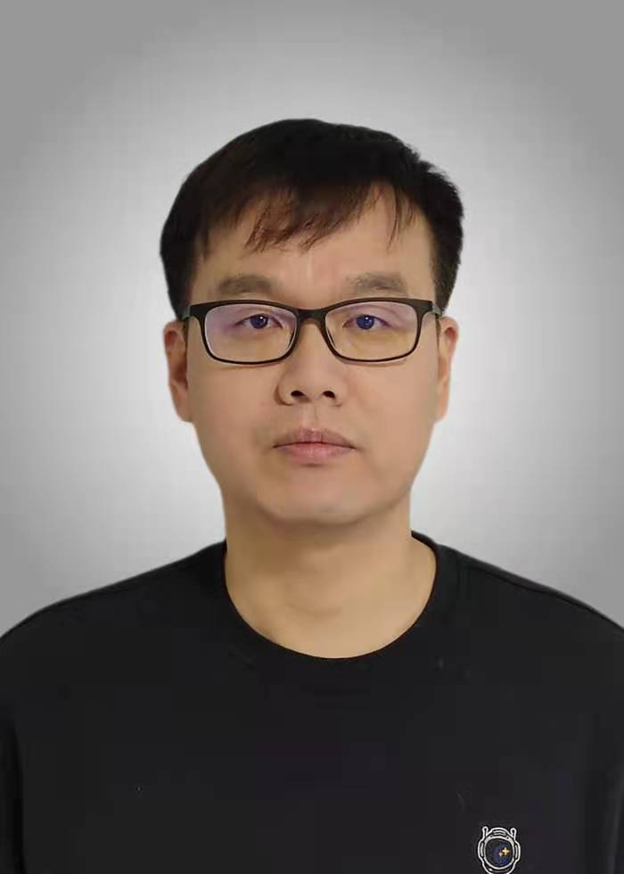

    

        

        
        

    

### RESEARCH INTERESTS

The focus of my research is on the development of statistical methods for single-cell RNA-seq (scRNA-seq) and chromatin interaction (Hi-C) data analysis, and their application to the genetic dissection of complex diseases and traits. In particular, I have developed single-cell aggregated clustering methods (implemented in software SAFE-clustering and SAME-clustering) for flexible, accurate and robust clustering scRNA-seq data. In addition, I also work on batch effect correction for single-cell RNA-seq data, which takes advantages of cell type/cluster information to guide supervised mutual nearest neighbor detection (SMNN method). More recently, I worked on the statistical framework for Hi-C peak calling (MUNIn program), and identifying and characterizing cardiovascular cell types in mouse and the wounding-related cell dynamics in zebrafish.

---

### PROFESSIONAL EXPERIENCE AND EDUCATION

    

            2009 - present:  <b>Associate Professor</b> 
            <a href="https://cie.shmtu.edu.cn/">College of Information Engineering</a> 
            <a href="https://www.shmtu.edu.cn/">Shanghai Maritime University</a> 
            Shanghai, China   
    

2004 - 2009:  <b>Graduate/Ph.D. Student</b> 
    Major: Pattern Recognition and Intelligent Systems 
    School of Electronic and Information Engineering 
    Tongji University, Shanghai, China 

2000 - 2004:  <b>Undergraduate/B.S. Student</b> 
    Major: Mathematics and Applied Mathematics 
    School of Mathematical 
    Tongji University, Shanghai, China 

---

---

### CONTACT INFORMATION

    

            <b>Email</b>: weilai@shmtu.edu.cn 
            <b>Office</b>: College of Information Engineering, 1550 Haigang Avenue, Shanghai, China 
            <b>GitHub</b>: <a href="https://github.com/weilyshmtu">https://github.com/weilyshmtu</a> 
    

